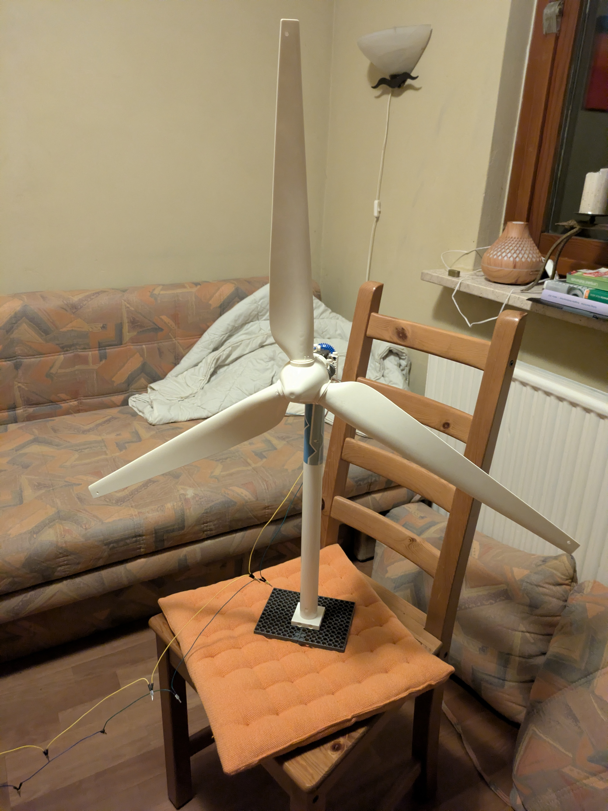
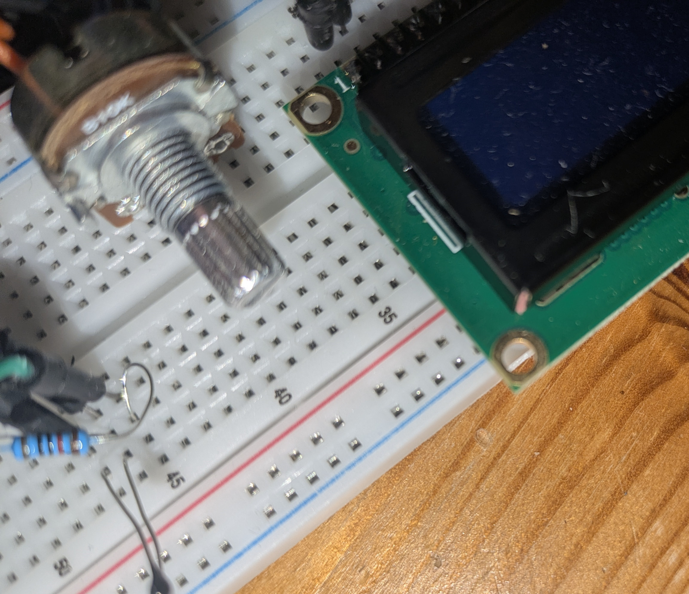
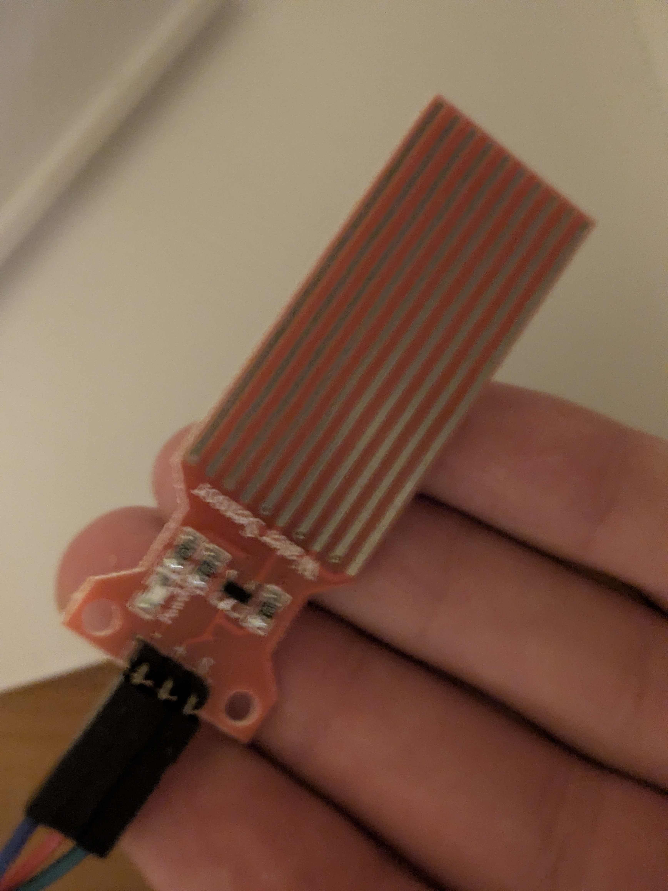
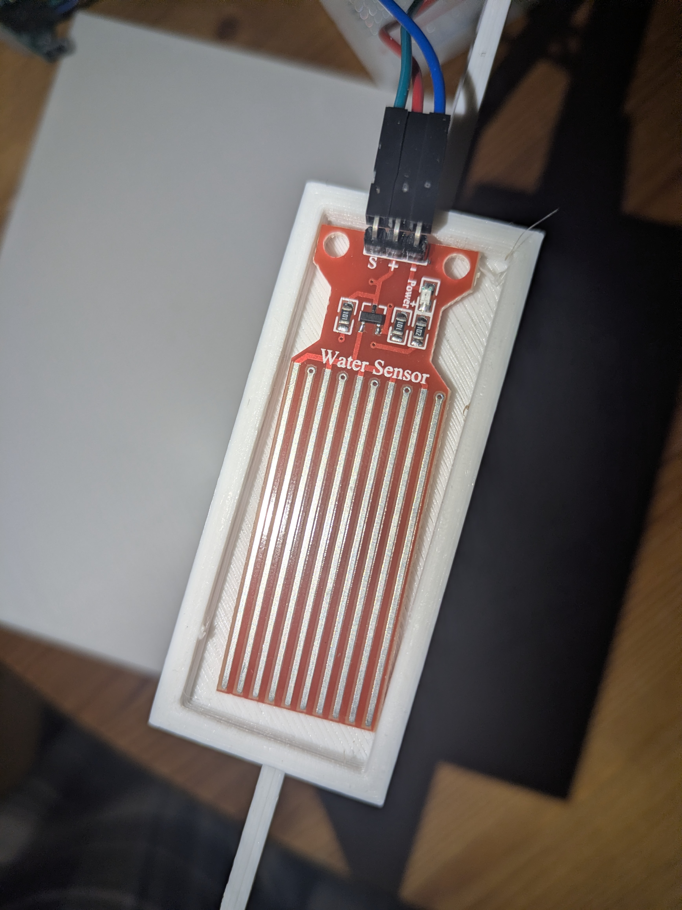
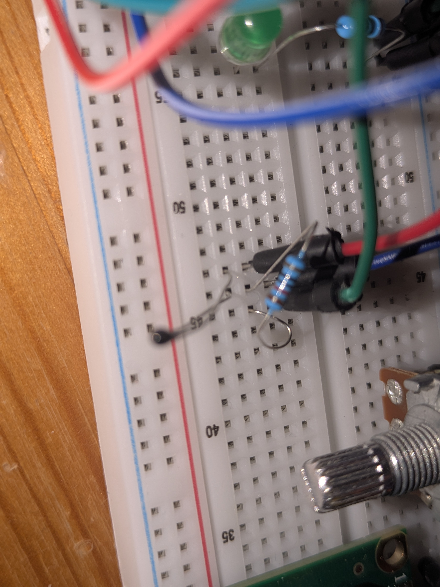
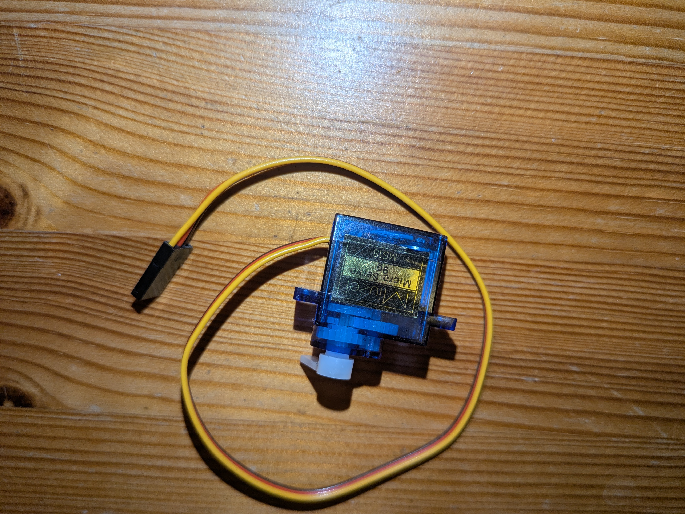
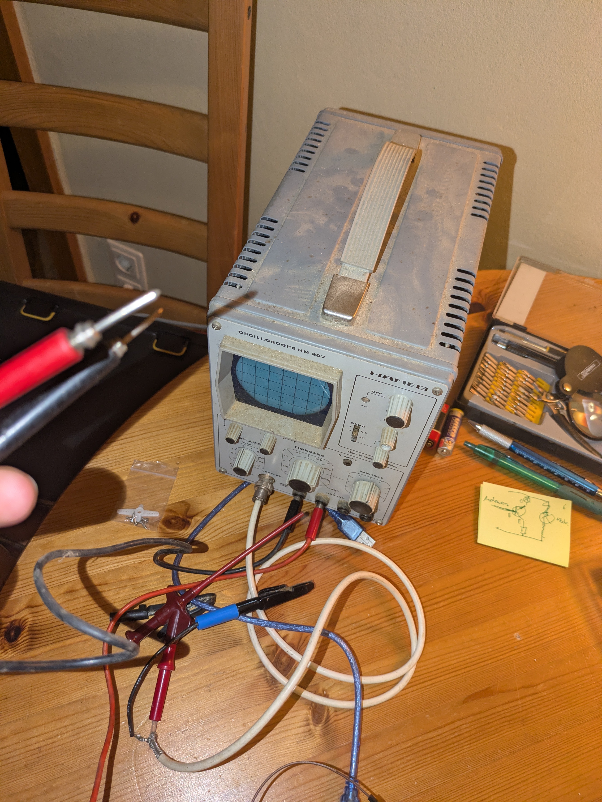

# : pinwheel!

[first I rebuilt an old pinwheel to produce electricity, with help of the wind (or my own force) for my smarthome ]

[]

[https://lapse.hackclub.com/timelapse/_OcYrT_oBJWh]

**Total time spent: 0.5hr**

# : lcd display

[then I wired and programmed the lcd display and later on I designed a little case for it in Autodesk Fusion and printed it. I also added a Potentiometer to adjust the brightness.]

[]
[]
[]

**Total time spent: 2-3hr**

# movementsensor!

[first I sketched the movement sensor on paper, wired and programmed it, while making a few little mistakes with the code. For this thing I also designed a frame, which I ended up not using, because it came out weird from the 3D printer. So I used a diffenrent structuring element I designed and printed, which was not specificly made for this sensor but also happened to fit]

[]
[]

**Total time spent: 3-4h**

# additional Sensors + outputs!

[build and coded an analogue thermistor and connected it to the lcd display, built and coded a waterlevel sensor +(designed and printed a hold for it, to clip it on the roof/window) and also connected it the lcd display, for the thermistor I also implemented a buzzer that could turn on, when it becomes too hot, in order to cool down then I needed to build a fan that could be run on the electricity the pinwheel provided so I build a fan and tested it first with an external voltage supplier - then was confused because it didnt work out and then I figuered out(after trying it with transistors and stuff) that I just had to plug it in differently so I got the fan working, but had no wires that were long enough to connect it to the pinwheel, so I made them myself and connected it to the pinwheel, in order to stand stable I also built something that could hold the fan - the first version wasnt as stable as I wanted it to be so I built a second on which was a little to small, but fitted very well so I printed a second one of them and put them together which worked just fine.Then I also wanted to add a servo for a door as a output for the movement sensor, but first it wouldnt work with the arduino so I tried it extern, which also didnt work, so I tried with some selfbuilt system (transistor+diode), which also didnt work out then I tested where the problem was hiding with measuring the voltage where I found out that the servo itself musthave been the problem I may have been a little harsh on him.. ]

[]
[]
[]
[]
[]
[]
[]
[]
[]
[]
[]
[]
**Total time spent: **

